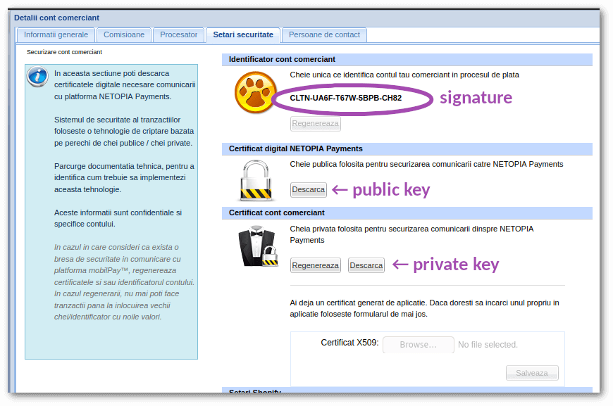

# Configuration

## Dotenv Values

The following `.env` parameters can be set in order to work with this package.

```dotenv
NETOPIA_SIGNATURE=ABCD-EFGH-1234-6789-XYZW
NETOPIA_PUBLIC_CERTIFICATE_PATH=/srv/site/config/netopia/ABCD-EFGH-1234-6789-XYZW.public.cer
NETOPIA_PRIVATE_CERTIFICATE_PATH=/srv/site/config/netopia/ABCD-EFGH-1234-6789-XYZWprivate.key
NETOPIA_SANDBOX=false
NETOPIA_RETURN_URL=https://your.site/payment/netopia/return
NETOPIA_CONFIRM_URL=https://your.site/payment/netopia/confirm
```

The signature, and the certficates can be obtained from the Netopia admin panel:



For more details about return and confirm URLs refer to [the Workflow section](workflow.md).

## Registration with Payments Module

The module will register the payment gateway with the Vanilo Payments registry by default.
This way you can get a gateway instance directly from the Payment registry:

```php
\Vanilo\Payment\PaymentGateways::make('netopia');
```

### Registering With Another Name

If you'd like to use another name in the payment registry, it can be done in the module config:

```php
//config/concord.php
return [
    'modules' => [
        //...
        Vanilo\Netopia\Providers\ModuleServiceProvider::class => [
            'gateway' => [
                'id' => 'mobilpay'
            ]
        ]
        //...
    ]
];
```

After this you can obtain a gateway instance with the configured name:

```php
\Vanilo\Payment\PaymentGateways::make('mobilpay');
```

### Prevent from Auto-registration

If you don't want it to be registered automatically, you can prevent it by changing the module
configuration:

```php
//config/concord.php
return [
    'modules' => [
        //...
        Vanilo\Netopia\Providers\ModuleServiceProvider::class => [
            'gateway' => [
                'register' => false
            ]
        ]
        //...
    ]
];
```

### Manual Registration

If you disable registration and want to register the gateway manually you can do it by using the
Vanilo Payment module's payment gateway registry:

```php
use Vanilo\Netopia\NetopiaPaymentGateway;
use Vanilo\Payment\PaymentGateways;

PaymentGateways::register('netopia-or-whatever-name-you-want', NetopiaPaymentGateway::class);
```

## Binding With The Laravel Container

By default `NetopiaPaymentGateway::class` gets bound to the Laravel DI container, so that you can
obtain a properly autoconfigured instance. Typically, you don't get the instance directly from the
Laravel container (ie. `app()->make(NetopiaPaymentGateway::class)`) but from the Vanilo Payment
Gateway registry:

```php
\Vanilo\Payment\PaymentGateways::make('netopia');
```

The default binding happens so that all the configuration parameters are read from the config values
mentioned above. This will work out of the box and will be sufficient for most of the applications.

### Manual Binding

It is possible to prevent the automatic binding and thus configure the Gateway in a custom way in
the module config:

```php
//config/concord.php
return [
    'modules' => [
        Vanilo\Netopia\Providers\ModuleServiceProvider::class => [
            'bind' => false,
```

This can be useful if the Gateway configuration couldn't be set in the env file, for example when:

- The credentials can be configured in and Admin interface
- Your app has multiple payment methods using the same gateway (eg. Card, SMS or Wallet)
- There is a multi-tenant application, where each tenant has their own values

Setting `vanilo.netopia.bind` to `false` will cause that the class doesn't get bound with the
Laravel DI container automatically. Therefore, you need to do this yourself in your application,
typically in the `AppServiceProvider::boot()` method:

```php
$this->app->bind(NetopiaPaymentGateway::class, function ($app) {
    return new NetopiaPaymentGateway(
        config('vanilo.netopia.signature'), // You can use different source than config
        config('vanilo.netopia.public_certificate_path'), // for these parameters
        config('vanilo.netopia.private_certificate_path'),
        config('vanilo.netopia.sandbox'),
        config('vanilo.netopia.return_url'),
        config('vanilo.netopia.confirm_url')
    );
});
```

---

**Next**: [Workflow &raquo;](workflow.md)
